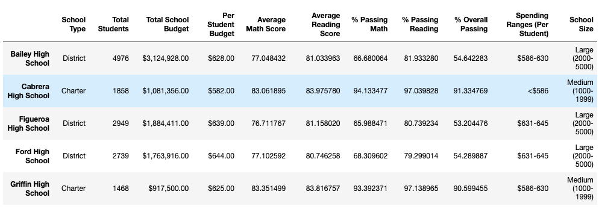

# School District Analysis

## Overview

The purpose of this project is to give a summary analysis of data from all the high schools in a school district. Specifically we were looking for a summary of school spending, both in total and per student, average math and reading scores, percentage of students passing math and reading, and school size.

This is an update on the original analysis, accounting for data that had to be removed. These are the results of removing that data on the finished product.

## Results

* District Summary: Because of alleged academic dishonesty from one school, its 9th grade math and reading scores had to be removed from the analysis. I removed them by finding the 9th graders' scores with the Pandas `loc` method and replacing them with Numpy's `NaN` values. Those scores were effectively ignored for the analysis. You can see how the values change in this portion of the district analysis dataframe.

  

* School Summary: 

  

  

* 

