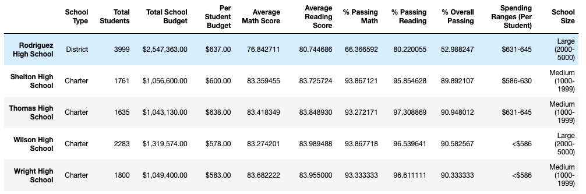
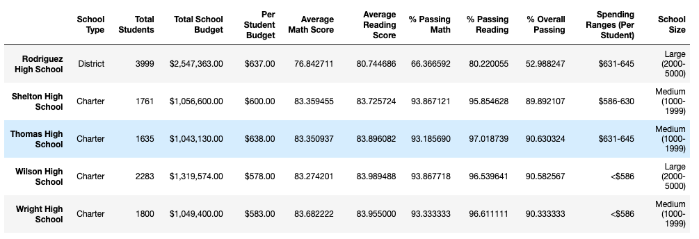

# School District Analysis

## Overview

The purpose of this project is to give a summary analysis of data from all the high schools in a school district. Specifically we were looking for a summary of school spending, both in total and per student, average math and reading scores, percentage of students passing math and reading, and school size.

This is an update on the original analysis, accounting for data that had to be removed. These are the results of removing that data on the finished product.

## Results

* District Summary: Because of alleged academic dishonesty from one school, its 9th grade math and reading scores had to be removed from the analysis. I removed them by finding the 9th graders' scores with the Pandas `loc` method and replacing them with Numpy's `NaN` values. Those scores were effectively ignored for the analysis. You can see how the values change in this portion of the district analysis dataframe.

  

* School Summary: This dataframe is a summary of all the factors we were looking for, displayed for each school in the district. The only things that changed in this summary were the reading and math scores and the passing percentages for the school that needed changes, Thomas High School. As we can see, those values only changed by a few hundredths of a percent.

  Per-school summary (before changes)
  
  
  Per-school summary (after changes)
  

* Thomas high school performance: Even though the scores changed for Thomas High School, the changes did not affect the school's ranking in performance in the summary. Here we can see the top 5 schools both before and after the changes, and Thomas High School maintains its place in the second spot.

  Top 5 schools (before changes)
  
  
  Top 5 schools (after changes)
  

* Math and reading scores by grade: As we can see, when we look at the math and reading scores by grade after making the changes, the 9th grade math and reading scores for Thomas High School are not included in the chart, and just show up as "NaN". 

    

* Scores by school spending: The spending range that Thomas High School fits into, $631-645, was NOT affected by the changes enough to change the percentages.

  

* Scores by school size: The school size Thomas High School fits into, medium (1000-1999), was NOT affected by the changes enough to change the percentages.

  

* Scores by school type: The school type Thomas High School fits into (charter) was NOT affected by the changes enough to change the percentages.

  
  
## Summary

Removing the Thomas High School 9th grade math and reading scores from the analysis slightly changed the average scores and passing percentages for Thomas High School. However, other factors were not affected, like Thomas High School's rank in the district or scores for the school types, spending ranges, and sizes.

